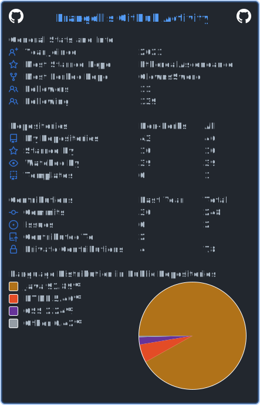

# Hey im Prangell

I am an English game developer and programmer

I work on a wide range of projects on both backend and frontend develeopment utilising languages such as Java, C#, Java Script, Alpine.js and more!

I also use Figma for UI design and Aseprite for pixel art

I have tons of pinned projects featured, but my favourite has to be [LLGDragons: Re-Fabricated](https://github.com/PrangellPlays/LLGDragons_ReFabricated)

I have 40+ public repositories with even more that are private

